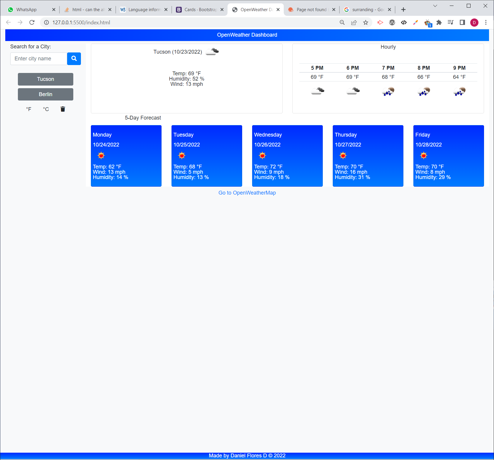

# OpenWeather Dashboard

## Description

This project aims to implement a weather forcast dashboard using the openweathermap.org API. The dashboard has the following features:
* City based search for weather forcast information.
* Display today's city weather information including: Temperature, weather description, humidity and wind speed.
* Hourly weather forcast for the next 5 hours.
* Next 5 days weather forecast.
* Selector for temperature units (°F/°C).
* Search city history stored in local storage. 
* Clear search 🗑 button
* Link to the openweathermap.org weathermap for temperature information on the city's surrounding area 

The application is implemented using jQuery,Bootstrap, and the openweathermap.org weather API. The website also features a responsive desing.

## Installation
Respository can be accessed at https://github.com/danielfloresd/openweather-dashboard/

## Usage
To view the website, please visit https://danielfloresd.github.io/openweather-dashboard/

## Credits

Started code & reset.css provided by UofA bootcamp. Weather data provided by https://openweathermap.org.

<!-- User Story
AS A traveler
I WANT to see the weather outlook for multiple cities
SO THAT I can plan a trip accordingly
Acceptance Criteria
GIVEN a weather dashboard with form inputs
WHEN I search for a city
THEN I am presented with current and future conditions for that city and that city is added to the search history
WHEN I view current weather conditions for that city
THEN I am presented with the city name, the date, an icon representation of weather conditions, the temperature, the humidity, and the the wind speed
WHEN I view future weather conditions for that city
THEN I am presented with a 5-day forecast that displays the date, an icon representation of weather conditions, the temperature, the wind speed, and the humidity
WHEN I click on a city in the search history
THEN I am again presented with current and future conditions for that city -->

